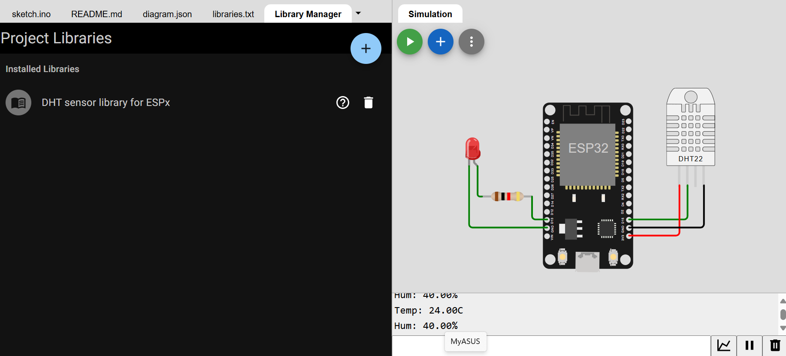
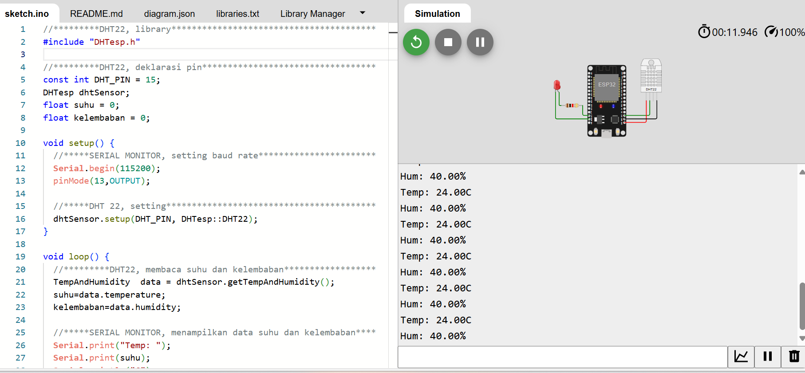

 

> Arr CyberFullstackDeveloperArr

|  **Penjelasan**             |
|---------------------|
| 
Project ini adalah sebuah skema sirkuit elektronik yang menggunakan ESP32 Devkit V1, sensor DHT22, resistor, dan LED. Skema ini dirancang untuk menghubungkan dan mengatur komunikasi antara komponen-komponen tersebut. ESP32 Devkit V1 berfungsi sebagai mikrokontroler utama yang menghubungkan sensor DHT22 untuk membaca data suhu dan kelembapan. Data dari sensor DHT22 dikirim ke ESP32 melalui pin SDA dan VCC (power supply) serta GND (ground). LED yang terhubung melalui resistor diatur untuk memberikan indikasi visual. LED ini dihubungkan ke pin digital D13 pada ESP32, sementara resistor digunakan untuk membatasi arus pada LED, dengan salah satu terminal resistor terhubung ke pin LED dan terminal lainnya ke pin ground pada ESP32. Skema ini juga terhubung ke monitor serial untuk komunikasi data dengan ESP32, memungkinkan pemantauan data yang dikirim dari sensor.
 |
